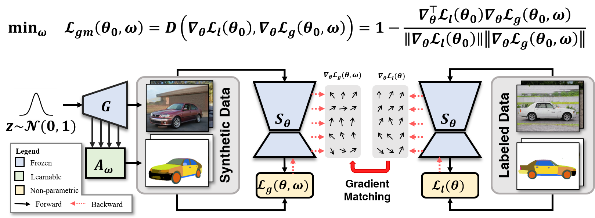
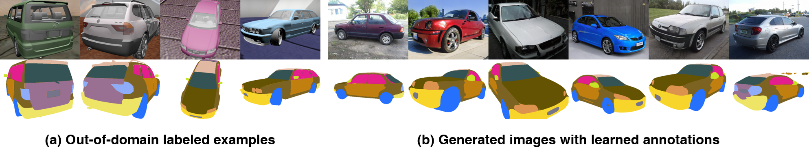

# LAGM

**Yu Yang, Xiaotian Cheng, Hakan Bilen, Xiangyang Ji. Learning to Annotate Part Segmentation with Gradient Matching. In ICLR 2022.** [[pdf](https://openreview.net/pdf?id=zNR43c03lRy), [bibtex](##Citation)]



## Preparing Datasets

**CelebA**

Download [CelebAMaskHQ](https://github.com/switchablenorms/CelebAMask-HQ) and create 
a symbolink to the data directory and make sure that the data folder looks like
```bash
data
├── CelebAMask-HQ
│   ├── CelebA-HQ-img               # Images   
│   └── CelebAMask-HQ-mask-anno     # Annotations
├── ...
...  
```

**Pascal-Horse & Pascal-Aeroplane**

1. Prepare Pascal VOC 2010 & Pascal Part annotation

    Download [Pascal VOC 2010](http://host.robots.ox.ac.uk/pascal/VOC/voc2010/index.html) 
    and [Pascal Part](http://roozbehm.info/pascal-parts/pascal-parts.html) annotation.
    Create a symbolink to the data directory and make sure that the data folder looks
    like 
    ```bash
    data
    ├── VOC2010
    │   ├── Annotations     
    │   ├── ImageSets              
    │   ├── JPEGImages          
    │   ├── part_segmentation
    │   │   └── Annotations_Part
    │   ├── SegmentationClass
    │   └── SegmentationObject
    ├── ...
    ...
   ``` 
   Preprocess the annotation by running 
   ```bash
   python utils/pascal_part_tool.py --pre
   ```

2. Copy images and segmentations
    ```bash
    python utils/pascal_part_tool.py --obj=[horse/aeroplane] --split=train/val \
    --src=/path/to/PASCAL_VOC/VOC2010 --dest=/path/to/pascal_part
    ```
   
3. Crop images and segmentations
    ```bash
    python utils/pascal_part_tool.py --obj=[horse/aeroplane] --split=train/test \
    --src=/path/to/PASCAL_VOC/VOC2010 --dest=/path/to/pascal_part --crop --minpx=[32/50]
    ```

4. Create a symbolink to the processed data directory and make sure that the data 
folder looks like 
    ```bash
    data
    ├── pascal_part
    │   ├── aeroplane     
    │   └── horse
    ├── ...
    ... 
    ```
   
**Car20, Cat16 & Face34**

Download Car20, Cat16 & Face34 from [DatasetGAN repo](https://github.com/nv-tlabs/datasetGAN_release)
and create a symbolink to the processed data directory and make sure that the data 
folder looks like
```bash
data
├── DatasetGAN
│   └── annotation
│       ├── training_data       # Training set
│       │   ├── face_processed
│       │   ├── car_processed
│       │   └── cat_processed
│       └── testing_data        # Testing set
│           ├── face_34_class
│           ├── car_20_class
│           └── cat_16_class
├── ...
...
```


**CGPart**
1. Download real dataset from [CGPart](https://qliu24.github.io/cgpart/) website. 
Download url: [CGPart_real](https://cs.jhu.edu/~qliu24/CGPart/cgpart_real.zip). 
The files should be structured as:
    ```bash
    data
    ├── CGPart_real
    │   ├── Annotations_png     # Containing original and cropped segmentation annotation
    │   ├── Images              # Containing cropped images
    │   ├── Image_sets          # Containing dataset split information
    │   ├── vp_aeroplane.txt    # Object Meta
    │   ├── vp_bicycle.txt
    │   ├── vp_bus.txt
    │   ├── vp_car.txt
    │   └── vp_motorbike.txt
    ├── ...
    ...
    ```

2. Render dataset for training

    Set up rendering environment according to [render-3d-segmentation repo](https://github.com/qliu24/render-3d-segmentation) and render 1000 image for each category. The rendering images are located at `data/CGPart_render` and structured like:
    
    ```bash
    data
    ├── CGPart_render
    │   └── car
    │       ├── image                                   # Images
    │       │   ├── 4ef6af15bcc78650bedced414fad522f    # Model ID
    │       │   │   ├── 000000.png  
    │       │   │   ├── ...
    │       │   ├── ...
    |       └── seg                                     # Segmentation Annotations
    │           ├── 4ef6af15bcc78650bedced414fad522f    # Model ID
    │           │   ├── 000000.png  
    │           │   ├── ...
    │           ├── ...
    ├── ...
    ...
    ```
   
   We provide our rendered images [here](https://drive.google.com/file/d/1noJ8Sa1e8IDfb4DV-weshXZLkv0zKevB/view?usp=sharing).

## Pre-trained StyleGAN

The pre-trained StyleGAN models are available in the following table.
Please organize the pre-trained models as described in "Path". 

| Dataset | Version | Path |
|:---     |:---     |:---  |
| CelebA            | StyleGAN2-ADA | [./checkpoints/stylegan2/celeba0-28k-paper256-ada.pkl](https://drive.google.com/file/d/1fdJxvJTUrazDShk17oY0I3kVf_bPLp2e/view?usp=sharing) |
| Pascal-Horse      | StyleGAN2     | [./checkpoints/stylegan2/stylegan2-horse-config-f.pkl](https://nvlabs-fi-cdn.nvidia.com/stylegan2/networks/stylegan2-horse-config-f.pkl) |
| Pascal-Aeroplane  | StyleGAN2     | [./checkpoints/stylegan2/lsunairplane-stylegan2-noaug-13200.pkl](https://drive.google.com/file/d/1wO3vRuuhAju2YYuYWDFuXvNDmWBGpluw/view?usp=sharing) |
| Cat-16            | StyleGAN      | [./checkpoints/stylegan_pt/karras2019stylegan-cats-256x256.for_g_all.pt](https://github.com/nv-tlabs/datasetGAN_release) |
| Cat-16            | StyleGAN2     | [./checkpoints/stylegan2/lsuncat200k-paper256-ada.pkl](https://nvlabs-fi-cdn.nvidia.com/stylegan2-ada/pretrained/paper-fig7c-training-set-sweeps/lsuncat200k-paper256-ada.pkl) |
| Face-34           | StyleGAN      | [./checkpoints/stylegan_pt/karras2019stylegan-celebahq-1024x1024.for_g_all.pt](https://github.com/nv-tlabs/datasetGAN_release) |
| Face-34           | StyleGAN2-ADA | [./checkpoints/stylegan2/celeba28k-paper512-ada.pkl](https://drive.google.com/file/d/1g6IhvUFXf3qtdnLdoC9f4Bs19KNeoIqI/view?usp=sharing) |
| Car-20            | StyleGAN      | [./checkpoints/stylegan_pt/karras2019stylegan-cars-512x384.for_g_all.pt](https://github.com/nv-tlabs/datasetGAN_release) |
| Car-20            | StyleGAN2     | [./checkpoints/stylegan2/stylegan2-car-config-f.pkl](https://nvlabs-fi-cdn.nvidia.com/stylegan2/networks/stylegan2-car-config-f.pkl) |
| CGPart_car        | StyleGAN2     | [./checkpoints/stylegan2/stylegan2-car-config-f.pkl](https://nvlabs-fi-cdn.nvidia.com/stylegan2/networks/stylegan2-car-config-f.pkl) |


## Train annotator and segmentation network
```bash
CUDA_VISIBLE_DEVICES=0 python annotate_seg.py --outdir=/path/to/output/directory --cfg=/path/to/config/file 
```

## Train downstream segmentation network

```bash
CUDA_VISIBLE_DEVICES=0,1 python downstream_seg.py --outdir=/path/to/output/directory 
--generator=/path/to/generator/file --annotator=/path/to/annotator/checkpoints
--arch=[unet/deeplabv3_101] --num_class=[20/16/34] --segres [256 256/512 512] 
--val_data=[car/cat/face] 
```

## Test segmentation network

**CelebA**
```bash
CUDA_VISIBLE_DEVICES=0 python test_seg.py --arch=[unet/deeplabv3_101]
--network_path=/path/to/network/directories 
--data=celeba --num_class=8 --segres 256 256 --testing_path=data/CelebAMask-HQ  
```
**Pascal-Horse & Pascal-Aeroplane**
```bash
CUDA_VISIBLE_DEVICES=0 python test_seg.py --arch=[unet/deeplabv3_101] 
--network_path=/path/to/network/directories 
--data=pascal --num_class=6 --segres 256 256 --testing_path=data/pascal-part/[horse/aeroplane]/test
```
**Cat16**
```bash
CUDA_VISIBLE_DEVICES=0 python test_seg.py --arch=[unet/deeplabv3_101] 
--network_path=/path/to/network/directories --num_class=16 --segres 256 256 
--testing_path=data/DatasetGAN/annotation/testing_data/cat_16_class --cv
```
**Face34**
```bash
CUDA_VISIBLE_DEVICES=0 python test_seg.py --arch=[unet/deeplabv3_101] 
--network_path=/path/to/network/directories --num_class=34 --segres 512 512 
--testing_path=data/DatasetGAN/annotation/testing_data/face_34_class --cv
```
**Car20**
```bash
CUDA_VISIBLE_DEVICES=0 python test_seg.py --arch=[unet/deeplabv3_101] 
--network_path=/path/to/network/directories --num_class=20 --segres 512 512 
--testing_path=data/DatasetGAN/annotation/testing_data/car_20_class --cv
```

## Main results

**Semi-supervised Part Segmentation Benchmark (real images as labeled data)**

| Dataset | #Labels | FG-mIoU | config file | checkpoints |
|:---     |:---:    |:---:  |---:| ---:|
| CelebA  | 2   | 56.55 | config/celeba/celeba_2_stylegan2_256x256.json | [celeba-2](https://drive.google.com/file/d/1HALba2UEqvdb0Sei8SxUNzlLlLtR4cH8/view?usp=sharing) |
| CelebA  | 10  | 74.41 | config/celeba/celeba_10_stylegan2_256x256.json | [celeba-10](https://drive.google.com/file/d/1Gl-wqenfM4Qs81o76I9yNbbh0e-cjYuX/view?usp=sharing)|
| CelebA  | 30  | 77.23 | config/celeba/celeba_30_stylegan2_256x256.json | [celeba-30](https://drive.google.com/file/d/1VG7K_D6_uw5ZANeAh-tRJfA5jy9t2yf6/view?usp=sharing) |
| CelebA  | 150 | 77.96 | config/celeba/celeba_150_stylegan2_256x256.json | [celeba-150](https://drive.google.com/file/d/1baHHhoBlMXkglTXdnQ6bn4POb2FQKOMR/view?usp=sharing) |
| CelebA  | 1500| 78.07 | config/celeba/celeba_1500_stylegan2_256x256.json | [celeba-1500](https://drive.google.com/file/d/1rgoYO3nlFmls-44HizlJY3-sQRhJT63g/view?usp=sharing) |
| Pascal-Horse  | 2     | 37.25 | config/pascal_horse/horse_2_stylegan2.json | [horse-2](https://drive.google.com/file/d/1oyXn7xXRNDt9hvTjMbO7EM5wAASWizli/view?usp=sharing) |
| Pascal-Horse  | 10    | 48.59 | config/pascal_horse/horse_10_stylegan2.json | [horse-10](https://drive.google.com/file/d/1WMsg6kNhpF-WRphvlM9EtmrdMeJoQFl3/view?usp=sharing) |
| Pascal-Horse  | 30    | 54.29 | config/pascal_horse/horse_30_stylegan2.json | [horse-30](https://drive.google.com/file/d/1sJstAzoxo4qNV2kgVXNB3gSqJfE8GCdO/view?usp=sharing) |
| Pascal-Horse  | 100   | 56.16 | config/pascal_horse/horse_100_stylegan2.json | [horse-100](https://drive.google.com/file/d/1dqFl8HQx-2k6V2WK3YF-dgshR9V67ME1/view?usp=sharing) |
| Pascal-Horse  | 180   | 56.83 | config/pascal_horse/horse_180_stylegan2.json | [horse-180](https://drive.google.com/file/d/1PAa32WJYGIIyLB8F0-s4_Ufmno9D1MX2/view?usp=sharing) |
| Pascal-Aeroplane | 2   | 29.01 | config/pascal_aeroplane/aeroplane_2_stylegan2.json | [aeroplane-2](https://drive.google.com/file/d/1Ca-BYlmj68KEOHASrGpADDfbreKPq-en/view?usp=sharing) |
| Pascal-Aeroplane | 10  | 34.29 | config/pascal_aeroplane/aeroplane_10_stylegan2.json | [aeroplane-10](https://drive.google.com/file/d/1Kp-VQ4f0fX1I6wtW3NfrscLkIxP8OrHq/view?usp=sharing) |
| Pascal-Aeroplane | 30  | 38.66 | config/pascal_aeroplane/aeroplane_30_stylegan2.json | [aeroplane-30](https://drive.google.com/file/d/1Kp-VQ4f0fX1I6wtW3NfrscLkIxP8OrHq/view?usp=sharing) |
| Pascal-Aeroplane | 100 | 42.94 | config/pascal_aeroplane/aeroplane_100_stylegan2.json | [aeroplane-100](https://drive.google.com/file/d/17MZgUiRZ7Lvn92J4TCT8rbgD8dlH0P_q/view?usp=sharing) |
| Pascal-Aeroplane | 180 | 41.21 | config/pascal_aeroplane/aeroplane_180_stylegan2.json | [aeroplane-180](https://drive.google.com/file/d/1qMZ2iGFRqiA-jU43CEhpSDwJKEOycrl0/view?usp=sharing) |

**Comparison to DatasetGAN (generated images as labeled data)**

| G | S | Cat-16 | Face-34 | Car-20 | 
|:--- |:---    |:---:    |:---:  |:---:|
| StyleGAN | DeepLab    | 33.89 ± 0.43 | 52.58 ± 0.61 | 63.55 ± 2.25 | 
| StyleGAN | UNet       | 32.64 ± 0.74 | 53.69 ± 0.54 | 60.45 ± 2.42 |
| StyleGAN2 | DeepLab   | 33.56 ± 0.17 | 55.10 ± 0.39 | 61.21 ± 2.07 |
| StyleGAN2 | UNet      | 31.90 ± 0.75 | 53.58 ± 0.45 | 58.30 ± 2.64 |

Configuration files are listed as below

| Dataset     | Cat-16 | Face-34 | Car-20 |
|:---         | :---:  |:---:    |:---:   |
| config file | config/cat16/*.json | config/face34/*.json | config/car20/*.json |

**Cross-domain annotator learning (out-of-domain images as labeled data)**

Using the following command to run cross-domain annotator learning
```
CUDA_VISIBLE_DEVICES=0 python annotate_seg.py --outdir=output/cgpart_car/ --cfg=configs/cgpart_car/car_stylegan2_256x192.json
```
Results


## Acknowledgement
This repo is building on the framework of [stylegan2-ada-pytorch](https://github.com/NVlabs/stylegan2-ada-pytorch)
and has referenced source codes of [datasetGAN_release](https://github.com/nv-tlabs/datasetGAN_release)
and [DatasetCondensation](https://github.com/VICO-UoE/DatasetCondensation). 
Many thanks to authors of these repos.

## Citation
If you find this useful in your research, please consider citing:
```
@InProceedings{lagm2022yang,
    title     = {Learning to Annotate Part Segmentation with Gradient Matching,
    author    = {Yang, Yu and Cheng, Xiaotian and Bilen, Hakan and Ji, Xiangyang},
    booktitle = {ICLR},
    year      = {2022}
}
```